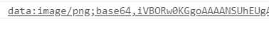
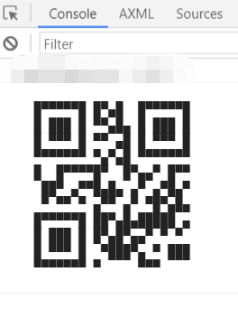
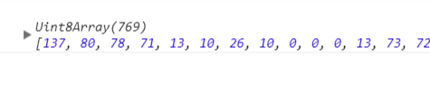
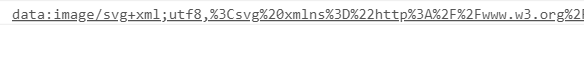
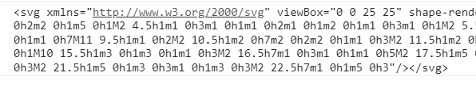

# cnf-qrcode
----------------------------
author: bugszhou | Email:bugszhou@outlook.com <br>
description: generate qrcode,support svg base64 utf8

> ps：本库是基于`node-qrcode`核心库的基础上改造而来，输出`base64/文本格式/svg`格式的二维码，利用图片的优势解决机型的兼容性

## Installation
Inside your project folder do:

```shell
npm install --save cnf-qrcode
```

## API

Browser&Server&小程序:
- [toDataURL()](#todataurltext-options-cberror-url)
- [toString()](#tostringtext-options-cberror-string)
- [toBuffer()](#tobuffertext-options-cberror-string)
- [getSvgDataURL()](#getsvgdataurltext-options-cberror-string)
- [getSvg()](#getsvgtext-options-cberror-string)

### `toDataURL(text, [options], [cb(error, url)])`
Returns a Data URI containing a representation of the QR Code image.<br>
生成`base64`等格式的二维码 <br>

#### `text`
Type: `String|Array`

Text to encode or a list of objects describing segments.

#### `options`
- ##### `type`
  Type: `String`<br>
  Default: `image/png`

  Data URI format.<br>
  Possible values are: `image/png`, `image/jpeg`, `image/webp`, `image/svg`.<br>

- ##### `rendererOpts.quality`
  Type: `Number`<br>
  Default: `0.92`

  A Number between `0` and `1` indicating image quality if the requested type is `image/jpeg` or `image/webp`.

See [Options](#options) for other settings.

#### `cb`
Type: `Function`

Callback function called on finish.

#### Example
```javascript
var opts = {
  errorCorrectionLevel: 'H',
  type: 'image/jpeg',
  rendererOpts: {
    quality: 0.3
  }
}

toDataURL('text', opts, function (err, url) {
  if (err) throw err

  console.log(url);
})
```
<br>

#### Result



### `toString(text, [options], [cb(error, string)])`

Returns a string representation of the QR Code.<br>


#### `text`
Type: `String|Array`

Text to encode or a list of objects describing segments.

#### `options`
- ###### `type`
  Type: `String`<br>
  Default: `utf8`

  Output format.<br>
  Possible values are: `utf8`, and `svg`.

See [Options](#options) for other settings.

#### `cb`
Type: `Function`

Callback function called on finish.

#### Example
```javascript
toString('http://www.google.com', function (err, string) {
  if (err) throw err
  console.log(string)
})
```

#### Result

In devtools



### `toBuffer(text, [options], [cb(error, string)])`

Returns a buffer representation of the QR Code.<br>


#### `text`
Type: `String|Array`

Text to encode or a list of objects describing segments.

#### `options`
- ###### `type`
  Type: `String`<br>
  Default: `utf8`

See [Options](#options) for other settings.

#### `cb`
Type: `Function`

Callback function called on finish.

#### Example
```javascript
toBuffer('http://www.google.com', function (err, buffer) {
  if (err) throw err
  console.log(buffer)
})
```

#### Result



### `getSvgDataURL(text, [options], [cb(error, url)])`
Returns a Svg Data URI containing a representation of the QR Code image.<br>
生成`data:image/svg+xml;utf8,...`格式的二维码 <br>

#### `text`
Type: `String|Array`

Text to encode or a list of objects describing segments.

#### `options`

- ##### `rendererOpts.quality`
  Type: `Number`<br>
  Default: `0.92`

  A Number between `0` and `1` indicating image quality if the requested type is `image/jpeg` or `image/webp`.

See [Options](#options) for other settings.

#### `cb`
Type: `Function`

Callback function called on finish.

#### Example
```javascript
var opts = {
  errorCorrectionLevel: 'L',
  rendererOpts: {
    quality: 0.3
  }
}

getSvgDataURL('text', opts, function (err, url) {
  if (err) throw err

  console.log(url);
})
```

#### Result



### `getSvg(text, [options], [cb(error, url)])`
Returns a Svg a representation of the QR Code image.<br>
生成`<scg></svg>`格式的二维码 <br>

#### `text`
Type: `String|Array`

Text to encode or a list of objects describing segments.

#### `options`

- ##### `rendererOpts.quality`
  Type: `Number`<br>
  Default: `0.92`

  A Number between `0` and `1` indicating image quality if the requested type is `image/jpeg` or `image/webp`.

See [Options](#options) for other settings.

#### `cb`
Type: `Function`

Callback function called on finish.

#### Example
```javascript
var opts = {
  errorCorrectionLevel: 'L',
  rendererOpts: {
    quality: 0.3
  }
}

getSvg('text', opts, function (err, url) {
  if (err) throw err

  console.log(url);
})
```

#### Result



## Options

### QR Code options
#### `version`
  Type: `Number`<br>

  QR Code version. If not specified the more suitable value will be calculated.

#### `errorCorrectionLevel`
  Type: `String`<br>
  Default: `M`

  Error correction level.<br>
  Possible values are `low, medium, quartile, high` or `L, M, Q, H`.

#### `maskPattern`
  Type: `Number`<br>

  Mask pattern used to mask the symbol.<br>
  Possible values are `0`, `1`, `2`, `3`, `4`, `5`, `6`, `7`.<br>
  If not specified the more suitable value will be calculated.

#### `toSJISFunc`
  Type: `Function`<br>

  Helper function used internally to convert a kanji to its Shift JIS value.<br>
  Provide this function if you need support for Kanji mode.

### Renderers options
#### `margin`
  Type: `Number`<br>
  Default: `4`

  Define how much wide the quiet zone should be.

#### `scale`
  Type: `Number`<br>
  Default: `4`

  Scale factor. A value of `1` means 1px per modules (black dots).

#### `width`
  Type: `Number`<br>

  Forces a specific width for the output image.<br>
  If width is too small to contain the qr symbol, this option will be ignored.<br>
  Takes precedence over `scale`.

#### `color.dark`
Type: `String`<br>
二维码条纹颜色(qrcode line color)<br>
Default: `#000000ff`

Color of dark module. Value must be in hex format (RGBA).<br>
Note: dark color should always be darker than `color.light`.

#### `color.light`
Type: `String`<br>
二维码背景色(qrcode background)<br>
Default: `#ffffffff`

Color of light module. Value must be in hex format (RGBA).<br>

<br>
